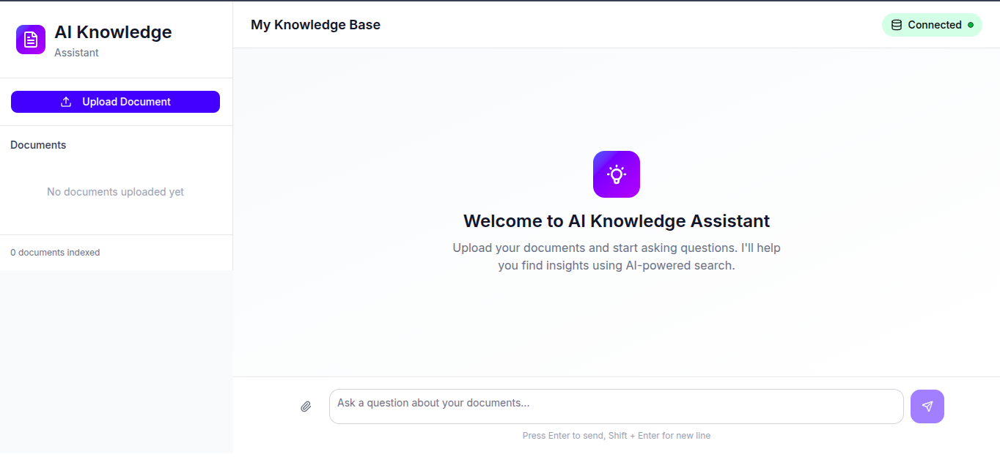
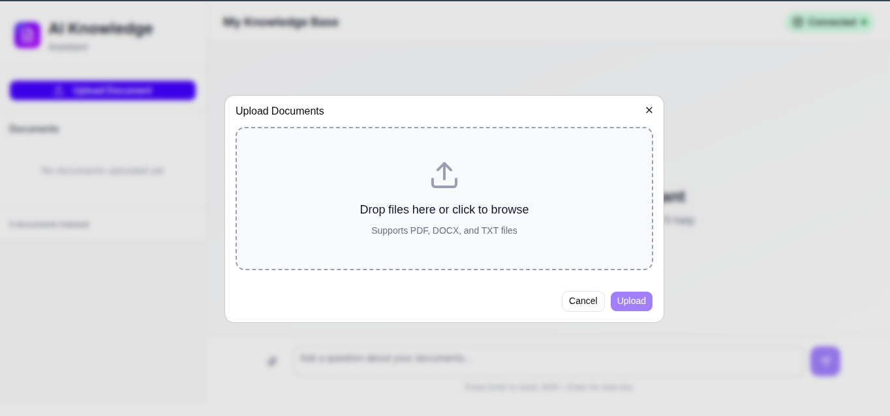

# 🤖 AI Knowledge Assistant


---

## 📌 Overview

**AI Knowledge Assistant** is an intelligent system designed to answer user queries, generate insights, and assist with knowledge retrieval using advanced AI models.

It acts as a **smart personal assistant**, capable of understanding natural language and delivering context-aware responses in real time.

---

## 🎯 Key Highlights

- 🤖 AI-driven conversational system
- ⚡ Real-time response generation
- 🧠 Context-aware answers
- 🌐 Scalable API-based architecture

---

## ✨ Features

- 🧠 AI-powered question answering
- 💬 Interactive chat interface
- ⚡ Fast backend processing
- 📄 Context-based responses
- 🔍 Knowledge retrieval system
- 🌐 REST API integration

---

## 🛠 Tech Stack

### 🎨 Frontend

- React
- Tailwind CSS

### ⚙️ Backend

- FastAPI / Flask

### 🤖 AI Integration

- OpenAI API / Gemini API

### 🧰 Tools

- Axios
- REST APIs

---

## 📸 Screenshots




---

## ⚙️ Installation

### 1️⃣ Clone Repository

```bash
git clone https://github.com/kannishhh/ai-knowledge-assistant
cd ai-knowledge-assistant

```

### 2️⃣ Backend Setup

```bash

cd backend
pip install -r requirements.txt
uvicorn main:app --reload
```

### 3️⃣ Frontend Setup

```bash
cd frontend
npm install
npm start
```

---

## 🔐 Environment Variables

Create a .env file in backend:
`OPENAI_API_KEY=your_api_key`

---

## 🏗 Architecture

User → Frontend (React) → Backend API → AI Model → Response → UI

---

## 🎯 Use Cases

- 📚 Student learning assistant
- 🔎 Quick research tool
- 💻 Developer debugging assistant
- ✍️ Content idea generator

---

## 🚀 Future Improvements

- 🧠 Memory-based chat (history support)
- 🎤 Voice input integration
- 🔗 Multi-model support (GPT + Gemini)
- 📄 Document/PDF upload & analysis

---

## 👨‍💻 Author

Kanish Kainth
🔗 https://github.com/kannishhh
